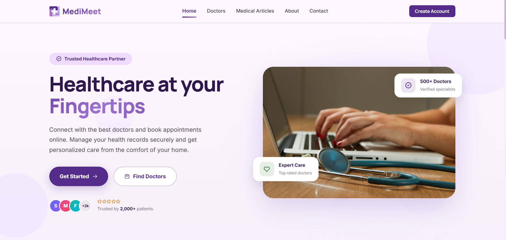

# MediMeet - Healthcare Platform



MediMeet is a comprehensive Healthcare Platform built with the MERN stack. It features distinct roles for Patients, Doctors, and Administrators, enabling seamless appointment booking, payment processing, schedule management, and administrative oversight.

## 🚀 Live Link
[https://medi-meet-lac.vercel.app/](https://medi-meet-lac.vercel.app/)

## 💻 Tech Stack
- **Frontend:** React, Vite, React Router DOM, Recharts, Stripe React
- **Backend:** Node.js, Express, MongoDB (Mongoose), JSON Web Tokens (JWT), bcryptjs
- **Services:** Cloudinary (Image storage), Stripe (Payments), Nodemailer (Emails), Node-cron (Scheduled tasks)

## ✨ Key Features & Modules

### 👤 Patient (User) Features
- **Appointment Booking:** Search for doctors, view schedules, and book appointments easily.
- **Medical Records:** Securely view and manage personal medical history, prescriptions, and test results.
- **Billing & Payments:** Seamlessly pay for appointments using Stripe integration and view billing history.
- **Health & Wellness:** Access wellness tips, blogs, and maintain personal health tracking.
- **Reviews:** Leave ratings and feedback for doctors post-appointment.

### 👨‍⚕️ Doctor Features
- **Schedule Management:** Set available slots and manage upcoming patient appointments.
- **Patient Management:** Access assigned patients' medical records to provide accurate diagnoses and prescriptions.
- **Profile Management:** Update specialty, qualifications, availability, and consultation fees.
- **Blogging:** Publish health-related articles and wellness tips to educate patients.

### 🛡️ Admin Features
- **Platform Management:** Full oversight over all users, doctors, and appointments on the platform.
- **Inventory & Billing:** Track system inventory, oversee global billing, and monitor platform revenue.
- **Verification:** Approve or reject doctor applications to ensure quality of care.
- **Analytics:** Access dashboards to view platform statistics and usage metrics.

## 🗄️ Database Models
The platform leverages MongoDB with the following core schemas:
- `User` & `Doctor` (Authentication, profiles, roles)
- `Appointment` (Scheduling, status tracking)
- `MedicalRecord` (Diagnoses, prescriptions)
- `Billing` (Invoices, payment status)
- `Blog` & `Wellness` (Content management)
- `Review` (Feedback system)
- `Inventory` (System assets tracking)
- `Contact` (Support inquiries)

## 📁 Folder Structure
```text
f:\Web Projects\MediMeet\
├── backend/            # Backend Node.js/Express application
│   ├── config/         # Configuration files (Database, Cloudinary, etc.)
│   ├── controllers/    # Route controllers
│   ├── middleware/     # Custom middlewares (Auth, Error handling)
│   ├── models/         # Mongoose schemas
│   ├── routes/         # Express API routes
│   └── utils/          # Utility functions
├── frontend/           # Frontend React/Vite application
│   ├── public/         # Public static assets
│   └── src/            # React components, pages, and context
├── vercel.json         # Vercel deployment configuration
└── package.json        # Root package configuration (for deployment scripts)
```

## 🔐 Test Credentials

### **Admin Accounts**
- **Email:** `kasfiamostafa03@gmail.com`
- **Password:** `kasfiamostafa03@gmail.com`
- **Email:** `shamim.osman.bd@gmail.com`
- **Password:** `shamim.osman.bd@gmail.com`

### **Doctor Account**
- **Email:** `mamun.uro@example.com`
- **Password:** `mamun.uro@example.com`

### **Patient (User) Accounts**
- **Email:** `kasfiasworna@gmail.com`
- **Password:** `kasfiasworna@gmail.com`
- **Email:** `ayesha.siddiqua.bd@gmail.com`
- **Password:** `ayesha.siddiqua.bd@gmail.com`

### **Test Payment Details (Stripe)**
- **Card Number:** `5555 5555 5555 4444`
- **CVC:** `111`
- **Expiry:** `04/28`

## 🛠️ Installation & Setup

1. **Clone the repository** (if not already done).
2. **Install dependencies:**
   The root directory is configured to build the frontend, but for local development you will want to install dependencies in both the backend and frontend folders.
   ```bash
   cd backend
   npm install
   cd ../frontend
   npm install
   ```
3. **Environment Variables:**
   Make sure you have `.env` files created inside both `backend/` and `frontend/` folders containing your respective API keys, MongoDB URI, Stripe keys, and Cloudinary secrets.
4. **Run Locally:**
   - For backend: `npm run dev` (inside `backend` directory)
   - For frontend: `npm run dev` (inside `frontend` directory)
